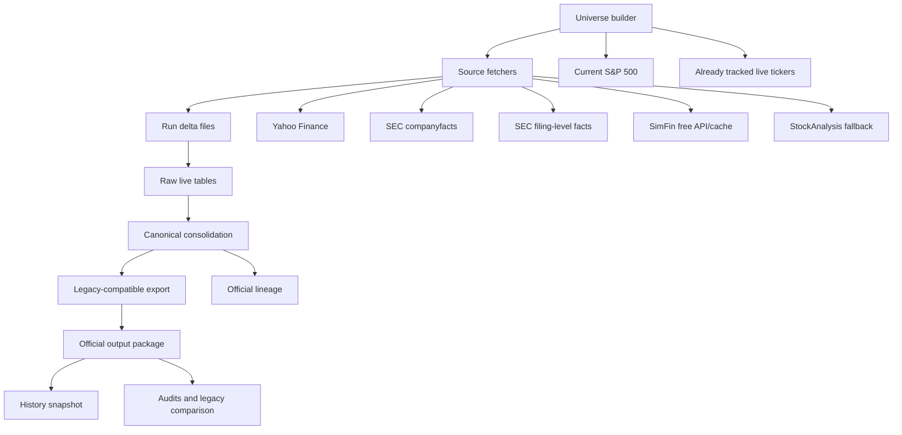

# Open-Source Data Ingestion Report - 2026-05-07

> Archived run report. It records one historical execution and is not the
> current ingestion contract.

## Executive Summary

The official open-source ingestion completed successfully on 2026-05-07.

- Run id: `20260507_171222`
- Mode: `daily`
- Official live store: `data/open_source/official`
- User-facing package: `data/open_source/output`
- Lineage package: `data/open_source/output/lineage`
- Backup snapshot created before republish: `data/open_source/history/output/open_source_output_20260507_183015`
- Legacy comparison report: `outputs/legacy_db_compare_20260507_203042/report.md`

The refreshed open-source package is a practical drop-in replacement for `run_legacy.py` on the aligned scope tested today: both EODHD and open-source produce the same latest holdings and the same combined backtest metrics.

Remaining caveat: the broader 2025 fundamental audit still shows non-trivial accounting-level differences versus EODHD for statements and shares. Those differences do not currently break `run_legacy.py`, but they still matter if future strategies use more raw statement KPIs directly.

## Official Folder Contract

The project has two interchangeable user-facing database packages:

- `data/eodhd/output`: frozen legacy reference package.
- `data/open_source/output`: official open-source replacement package.

Both packages expose the same legacy file names:

- `SP500_Constituents.csv`
- `SP500Price.parquet`
- `US_Finalprice.parquet`
- `US_General.parquet`
- `US_Income_statement.parquet`
- `US_Balance_sheet.parquet`
- `US_Cash_flow.parquet`
- `US_share.parquet`
- `US_Earnings.parquet`

Open-source adds official lineage under:

- `data/open_source/output/lineage`

Generated audits and investigations stay outside the official package:

- `data/open_source/audit`
- `outputs/legacy_db_compare_*`

## Ingestion Flow

## Daily Universe

The nightly ingestion does not use only current S&P 500 tickers. It uses:

`current S&P 500 union already tracked live tickers`

For this run:

- Current S&P 500 tickers: `508`
- Already tracked live tickers: `725`
- Effective nightly universe: `725`

This is intentional. Delisted or renamed tickers are noisy when queried through Yahoo, but they are kept in the universe so historical data is not silently killed.

## Source Strategy

### Prices

Priority is source consolidation, not blind replacement.

1. Yahoo Finance provides the normal daily price feed.
2. SimFin daily prices are used as fallback when Yahoo does not cover a ticker/history.
3. StockAnalysis is used as a second fallback for specific missing price histories.
4. SPY benchmark prices are fetched separately from Yahoo.

For this run:

- Price window refreshed: `2026-04-29` to `2026-05-07`
- Published open-source max price date: `2026-05-06`
- Price rows in `US_Finalprice.parquet`: `3,643,426`
- Price tickers in `US_Finalprice.parquet`: `725`
- Price backfill tickers: `1`
- SimFin price fallback tickers: `92`
- StockAnalysis price fallback tickers: `26`

### General Reference and Sector

`US_General.parquet` is built from a consolidated reference layer.

1. Yahoo company metadata is preferred for market-facing fields such as `Sector` and `industry`.
2. SEC profile/SIC data is used as fallback.
3. The exported `Sector` stays EODHD-compatible because `run_legacy.py` uses it in portfolio construction.

For this run:

- `US_General.parquet` rows: `835`
- `Sector` non-null rows: `835`

### Earnings

The canonical earnings layer separates calendar semantics from market EPS fields.

1. SEC filings provide canonical quarter/report timing where available.
2. Yahoo Finance provides market-facing EPS actual, estimate, and surprise when available.
3. SEC companyfacts can provide fallback actual EPS.
4. Missing free-source estimates are not synthesized.

For this run:

- `US_Earnings.parquet` rows: `22,952`
- Earnings tickers: `626`
- Latest actual from market source in the comparison gate: `98.24%`
- Latest estimate from market source in the comparison gate: `98.24%`

### Financial Statements

The four financial outputs are built from a source-priority consolidation:

1. SEC companyfacts
2. SEC filing-level parser
3. SimFin
4. Yahoo Finance financial tables

The clean layer can change retrospectively when a better source, mapping, or semantic repair is added. The raw layer is not deleted.

Published rows after today's run:

- `US_Income_statement.parquet`: `2,616` rows, `644` tickers
- `US_Balance_sheet.parquet`: `2,622` rows, `644` tickers
- `US_Cash_flow.parquet`: `2,603` rows, `644` tickers
- `US_share.parquet`: `3,229` rows, `636` tickers

## No-Delete and History Policy

The ingestion policy is append/upsert, not destructive replacement.

- Every run writes per-run deltas under `data/open_source/official/runs/<run_id>/raw`.
- Raw live tables under `data/open_source/official/raw` are updated by natural keys.
- Clean target tables under `data/open_source/official/target` are republished from raw.
- Before `data/open_source/output` is overwritten, the previous package is snapshotted under `data/open_source/history/output`.
- Delisted tickers are kept if they were already tracked.

This means the clean view can be corrected retrospectively, but raw data is preserved.

## Run Failures and Noise

Non-fatal issues recorded in the manifest:

- SEC companyfacts returned 404 for `POM`, so there is no SEC companyfacts data for that mapped CIK.
- SimFin `derived` quarterly bulk dataset returned HTTP 500 and was not available on disk.
- StockAnalysis returned 400 for several old/delisted ticker symbols.
- Yahoo emitted many "No earnings dates found" messages for delisted tickers. This is noisy but expected under the no-delete universe policy.

The run still completed and published the official output package.

## Legacy Comparison Result

Comparison output:

- Markdown: `outputs/legacy_db_compare_20260507_203042/report.md`
- HTML: `outputs/legacy_db_compare_20260507_203042/report.html`
- Executive summary: `outputs/legacy_db_compare_20260507_203042/executive_summary.md`

Aligned scope:

- Common ticker universe: `832`
- Common price cutoff: `2026-04-24`
- Common financial cutoff: `2026-02-28`
- Common earnings cutoff: `2026-03-19`
- First backtest month: `2025-01`

Backtest result:

- `Combined_Frequency`: `127.44%` total return on EODHD and `127.44%` on open-source.
- `Combined_Equal`: `127.44%` total return on EODHD and `127.44%` on open-source.
- CAGR gap: `0.00` points for both combined portfolios.
- Latest portfolio overlap: exact match for both combined constructions.
- Latest model slots: 100% overlap.
- Residual monthly return max absolute diff: `0.003783` bps.

Main reason the backtest now matches:

`run_legacy.py` values companies with earnings and shares semantics. The open-source legacy export now writes `commonStockSharesOutstanding` using the same legacy semantics as EODHD when the earnings-implied share count is consistent with reported shares. This preserves raw source lineage while making the old strategy comparable.

## Remaining Audit Gaps

The legacy method matches, but the broader source-vs-EODHD audit still has accounting-level differences:

- 2025 adjusted close raw audit error rate: `9.88%`
- 2025 income statement error rate: `22.08%`
- 2025 balance sheet error rate: `6.45%`
- 2025 cash flow error rate: `15.39%`
- 2025 shares error rate: `69.42%`
- 2025 earnings error rate: `47.05%`

Interpretation:

- These are source-level semantic differences versus EODHD, not necessarily fatal strategy differences.
- For `run_legacy.py`, current evidence says the open-source package is usable because the strategy path, optimizer outputs, final holdings, and combined metrics match on the aligned scope.
- For any future strategy using raw statement KPIs directly, keep using the audit reports before declaring parity.
