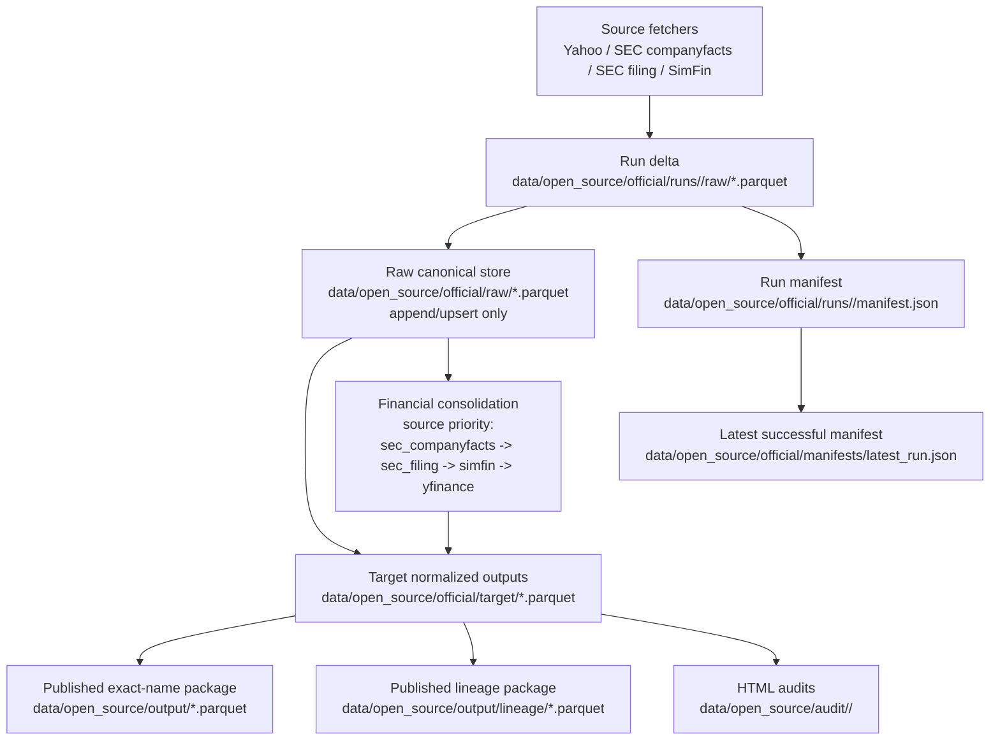
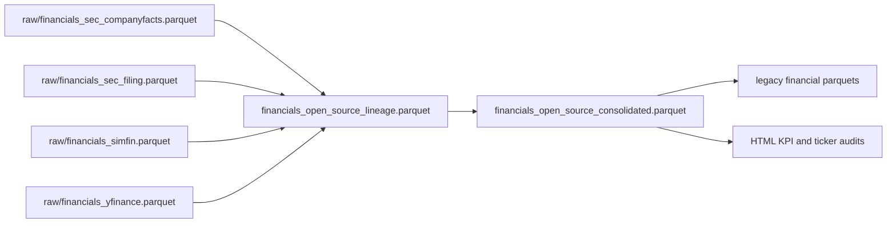

# Open-Source Ingestion Architecture

This document describes the open-source ingestion contract for AlphaRank.

The goal is not just to fetch data. The goal is to make the data store auditable, correctable, and safe for historical research.

## Core Rules

1. Raw source tables are the canonical store.
2. Raw source tables are append/upsert only. The ingestion pipeline does not delete raw rows.
3. Corrections are retrospective replacements on the same natural key, never silent drops of unrelated history.
4. Clean tables are rebuilt from the full raw store on every successful run.
5. Legacy-compatible exact-name outputs are published under `data/open_source/output/`.
6. The published lineage package lives under `data/open_source/output/lineage/`.
7. Every run writes its own immutable run delta under `data/open_source/official/runs/<run_id>/`.
8. The latest successful run is referenced by `data/open_source/official/manifests/latest_run.json`.

Important consequence:

- If a delisted ticker has already been ingested into `raw/`, a nightly rerun does not remove it from the official store.
- The current pipeline has no built-in delete or purge path for open-source data.

I verified this in code:

- `src/alpharank/data/open_source/storage.py`
  `upsert_parquet(...)` concatenates `existing + delta`, then keeps the latest row for the same natural key.
- `src/alpharank/data/open_source/ingestion.py`
  target outputs are rebuilt from the full `raw/*.parquet`, not only from the current nightly delta.
- `src/alpharank/data/open_source/` and `scripts/open_source/`
  there is currently no delete/remove/unlink/rmtree path for the official store.

## High-Level Flow



## Storage Layout

```text
data/open_source/
  README.md
  _cache/
  official/
    raw/
      general_reference.parquet
      prices_yfinance.parquet
      prices_spy_yfinance.parquet
      earnings_yfinance.parquet
      financials_sec_companyfacts.parquet
      financials_sec_filing.parquet
      financials_simfin.parquet
      financials_yfinance.parquet
    target/
      prices_open_source.parquet
      benchmark_prices_open_source.parquet
      earnings_open_source.parquet
      earnings_open_source_long.parquet
      financials_open_source_consolidated.parquet
      financials_open_source_lineage.parquet
      financials_open_source_source_summary.parquet
      legacy_compatible/
        US_Finalprice.parquet
        SP500Price.parquet
        US_General.parquet
        US_Income_statement.parquet
        US_Balance_sheet.parquet
        US_Cash_flow.parquet
        US_share.parquet
        US_Earnings.parquet
    manifests/
      latest_run.json
    runs/
      20260322_214417/
        raw/
        manifest.json
  output/
    US_Finalprice.parquet
    SP500Price.parquet
    US_General.parquet
    US_Income_statement.parquet
    US_Balance_sheet.parquet
    US_Cash_flow.parquet
    US_share.parquet
    US_Earnings.parquet
    lineage/
      financials_open_source_consolidated.parquet
      financials_open_source_lineage.parquet
      financials_open_source_source_summary.parquet
      manifest.json
  audit/
    2025/
      report.html
      tickers/
      kpis/
      *.parquet
      summary.json
  archive/
    ...
```

## Layer Contract

### `raw/`

Purpose:

- preserve normalized source facts
- keep source identity
- keep ingestion timestamps
- support full reconstruction of downstream outputs

Status:

- canonical
- append/upsert only
- never treated as disposable cache

Raw lineage columns:

- `source`
- `dataset`
- `ingestion_run_id`
- `ingested_at`

### `target/`

Purpose:

- provide a stable query layer for research and downstream exports
- merge source-specific raw tables into normalized outputs
- expose financial source selection and fallback behavior

Status:

- derived from raw
- safe to recompute
- can be replaced wholesale because it is reproducible from `raw/`

### `output/`

Purpose:

- expose the exact historical AlphaRank filenames in one user-facing folder
- give backtests a stable drop-in folder with no extra nesting

Status:

- published from `target/`
- user-facing
- not the internal source of truth

### `output/lineage/`

Purpose:

- expose the selected lineage package next to the exact-name outputs
- make it possible to inspect provenance without opening the internal store

Status:

- derived export
- not the authoritative storage layer

### `audits/`

Purpose:

- compare open-source outputs against the existing EODHD reference side
- provide ticker-level and KPI-level deep dives

Status:

- derived QA artifact
- safe to regenerate

### `runs/<run_id>/`

Purpose:

- freeze exactly what a given ingestion run fetched and wrote
- support debugging, replay, and forensic comparison between runs

Status:

- immutable run artifact
- if a run fails before manifest write, the partial run folder may exist without becoming the latest successful run

## Natural Keys and Correction Semantics

The pipeline updates data by natural key, not by full-table replacement.

### Price raw

File:

- `raw/prices_yfinance.parquet`
- `raw/prices_spy_yfinance.parquet`

Natural key:

- `ticker`
- `date`
- `source`

Correction rule:

- if the same ticker/date/source is fetched again later, the latest row by `ingested_at` wins
- all other dates and tickers remain untouched

### Financial raw

Files:

- `raw/financials_sec_companyfacts.parquet`
- `raw/financials_sec_filing.parquet`
- `raw/financials_simfin.parquet`
- `raw/financials_yfinance.parquet`

Natural key:

- `ticker`
- `statement`
- `metric`
- `date`
- `source`

Correction rule:

- if a restatement or corrected parsing produces the same logical fact again, the latest row wins on that key
- older unrelated quarters are not deleted

### Earnings raw

File:

- `raw/earnings_yfinance.parquet`

Natural key:

- `ticker`
- `reportDate`
- `source`

### General reference raw

File:

- `raw/general_reference.parquet`

Natural key:

- `ticker`
- `source`

## Financial Consolidation and Lineage

Financials are consolidated with this source priority:

1. `sec_companyfacts`
2. `sec_filing`
3. `simfin`
4. `yfinance`

The consolidated file is:

- `target/financials_open_source_consolidated.parquet`

The detailed candidate-level lineage file is:

- `target/financials_open_source_lineage.parquet`

The consolidated row carries:

- `selected_source`
- `selected_source_label`
- `selected_form`
- `selected_fiscal_period`
- `selected_fiscal_year`
- `source_priority`
- `fallback_used`
- `candidate_source_count`
- `candidate_sources`
- `candidate_source_labels`

That means every selected financial fact can be traced back to:

- which source won
- which lower-priority sources also existed
- which filing form and fiscal period were attached when available



## Bootstrap vs Daily

### Bootstrap

Intent:

- seed the official store with the historical universe you care about

Typical use:

- first load from `2005-01-01`
- broad historical universe
- creates the base coverage for delisted names

Behavior:

- prices are fetched from the explicit `start_date`
- financial refresh years span from `start_date` to `end_date`

### Daily

Intent:

- incrementally refresh a store that already exists

Behavior:

- prices refresh from `max(existing_date) - price_lookback_days`
- financials refresh for recent years only via `financial_lookback_years`
- target, legacy, and audit layers are rebuilt from the full raw store

Important limitation:

- daily preserves delisted names that already exist in the store
- daily does not magically discover old delisted names that were never bootstrapped in the first place

## Nightly Universe Policy

The nightly runner in `scripts/open_source/nightly_ingestion.py` now defaults to:

- current S&P 500 universe from `SP500_Constituents.csv`
- union existing official tickers already present in `data/open_source/official/raw/`

This prevents the nightly process from silently narrowing the update universe after a broader historical bootstrap.

In practice:

- if you bootstrap a broader universe once, those tickers remain part of the nightly target set
- if a ticker later leaves the index or becomes delisted, its already-ingested history stays in `raw/`
- downstream `target/` and `legacy_compatible/` continue to include that history because they rebuild from the full raw store

## What Can Change Retrospectively

These are normal and expected:

- stock split adjustments
- corrected parsing logic
- SEC amended filings
- vendor revisions
- improved fallback source coverage

When that happens, the intended mechanism is:

1. fetch corrected source facts
2. upsert on the same natural key
3. keep the new version as the latest row
4. rebuild target and legacy exports from raw

What the pipeline should not do:

- wipe a raw table because the current nightly universe is smaller
- drop delisted rows because the source no longer returns fresh data
- overwrite the store with a subset snapshot

## Operational Safety Notes

1. `raw/` is the asset to protect and back up.
2. `target/`, `output/`, `output/lineage/`, and `audit/` are reproducible.
3. `runs/<run_id>/` is the best place to debug a suspicious nightly run.
4. `manifests/latest_run.json` should be treated as the pointer to the latest successful run, not just the latest attempted run.
5. If you ever want an actual purge workflow, it should be implemented as an explicit maintenance tool with its own manifest and review step. It should not be implicit in the ingestion runner.

## Current Gaps

This architecture protects lineage and historical retention, but it does not magically solve source coverage gaps.

Known weak spots remain:

- `shares`
- some `gross_profit` / `operating_income` coverage
- historical earnings coverage from free sources
- old delisted names that were never seeded during bootstrap

Those are source-quality problems, not store-integrity problems.
