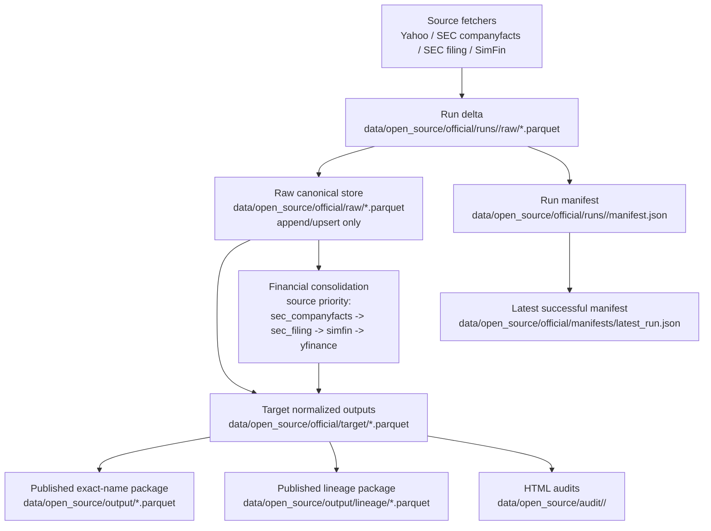
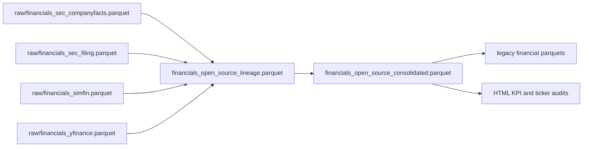

# Open-Source Ingestion Architecture

This document describes the open-source ingestion contract for AlphaRank.

The goal is not just to fetch data. The goal is to make the data store auditable, correctable, and safe for historical research.

The implementation follows the same stages: `ingestion.py` owns transactional
orchestration, `ingestion_frames.py` owns shared schemas, `ingestion_prices.py`
owns the price stage, and `ingestion_reference.py` owns reference, earnings and
fundamental acquisition. Stage modules do not import the orchestrator; the
historical `ingestion.py` private names remain aliases during reader migration.

Important scope note:

- this document describes the multi-source open-source store under `data/open_source/`
- the SEC-only fundamentals package has its own contract in `docs/sec_fundamentals_contract.md`
- the June 2026 replayability and data-drift incident is tracked in `docs/sec_data_robustness_plan.md`

## Official Fundamental Contract: SEC/GAAP Only

Official model fundamentals come exclusively from the SEC package documented
in `docs/sec_fundamentals_contract.md`:

- SEC companyfacts;
- filing-level SEC XBRL;
- explicitly labelled derived values calculated only from SEC facts.

EODHD fundamental values are excluded because the historical vendor fields can
mix non-GAAP semantics with GAAP facts. Yahoo, SimFin, StockAnalysis, and EODHD
may be used for research discrepancy analysis, but none may fill a missing
official fundamental value. A historical EODHD ticker/CIK mapping is permitted
only as an identity bridge to reach the SEC; it is not a value source.

`data/open_source/output` still publishes a multi-source consolidation for R&D
and transition audits. It must not be mistaken for the official monthly
fundamental package. `data/sec/output` is an older SEC-only baseline; current
production resolves the immutable SEC-only successor through
`data/model_inputs/manifests/latest.json`.

### Verified status on 2026-08-16

Fresh full ingestion `20260816_103942` downloaded prices through 2026-08-14
and SEC filings through 2026-08-14. The mutable mixed-source output remains an
R&D artifact, but the production composition gap is now closed by immutable
snapshot `outputs/production_refresh_20260816/composed_history/alpharank_input_20260816_115416_2a01288bab06`
(composition id `2a01288bab06102fce4f18cfd66c04e416fb4b3236aa5edf4c46a0ea213be9be`).
The canonical pointer is `data/model_inputs/manifests/latest.json`, resolving
the hash-identical historized copy under `data/model_inputs/history/`.

Its price package rolls forward the reviewed EODHD/Yahoo candidate: 338
inactive or terminal tickers are preserved from the prior validated lineage,
502 refreshable active tickers use only Yahoo vintage `20260816_103942`, and
EA is the sole carried-forward terminal exception after its sourced 2026-08-05
index removal. The strict gate reports zero historical key removals, zero
historical return-availability changes, zero old daily-return revisions above
1 bp, and zero adjustment-transition findings.

The SEC package preserves 509,254 raw Companyfacts filing versions. Raw
uniqueness now includes `filing_date`; model exports select the earliest filing
version per ticker/statement/metric/period/source. The one-time migration from
the previously collapsed raw store is explicitly approved in the SEC manifest
and retains the exhaustive 730-day revision guard. Both packages are copied
into the composed snapshot and all nine model files are hash-verified.

### Repeatable routine refresh after the migration

The next refresh is not "refresh SEC and overwrite one folder". It is one
fail-closed promotion sequence:

1. run a full network ingestion to a timestamped candidate; Companyfacts,
   submissions, current-member Yahoo histories, SPY, and membership must pass
   freshness checks;
2. roll the latest validated price lineage forward with
   `scripts/open_source/publication/build_roll_forward_price_package.py`; by default it
   resolves that lineage from `data/model_inputs/manifests/latest.json`.
   Inactive histories remain byte-stable, including tickers first downloaded
   from Yahoo and absent from EODHD. Active histories come from one new Yahoo
   vintage, `persistent_price_history_registry.parquet` records every retained
   trajectory, and the historical return/key gates must pass without routine
   overrides;
3. build the strict SEC-only package with
   `scripts/open_source/publication/build_sec_output_package.py`; the 730-day revision guard
   must pass without `--allow-historical-revisions` now that the one-time raw
   version migration is complete;
4. compose both validated packages with
   `scripts/open_source/publication/build_composed_model_snapshot.py`; update
   `data/model_inputs/manifests/latest.json` only after all source hashes and
   source allowlists pass;
5. launch Legacy on that immutable path, launch Boosting on the exact retained
   Legacy `input_snapshot/`, then require the common lineage/calendar replay.

Any failed step leaves the previous pointer and production truth unchanged.

### Previous verified status on 2026-08-15

The retained T1 snapshot `open_source_output_20260811_014746` selected 426,195
consolidated fundamental values: 406,952 from SEC companyfacts/filing extraction
and 19,243 from non-SEC fallbacks (14,754 Yahoo and 4,489 SimFin). Legacy runs
that consumed this single-folder snapshot are reproducible, but they are not
compliant with the clarified SEC-only production contract.

`data/open_source/output` must still be labelled mixed-source research/replay
data. The immutable composed snapshot described above supersedes this former
composition gap for new model runs.

## Historical Price Contract: Frozen EODHD Base Plus Open Updates

Price history is intentionally different from fundamentals. Cancelling the
EODHD subscription stopped future downloads; it did not make the already-paid
historical archive disposable. The required long-run price package is hybrid:

1. `data/eodhd/output/US_Finalprice.parquet` is the immutable EODHD historical
   seed, including former constituents and delisted companies that Yahoo no
   longer returns;
2. open sources refresh or extend securities that remain downloadable;
3. a missing Yahoo response must never delete or replace an EODHD-only history;
4. every selected row must retain its real source, including
   `eodhd_frozen_history` for seeded rows;
5. vendor transitions and split adjustments must be stitched and audited
   explicitly. A rolling Yahoo tail must not be pasted onto an incompatible
   EODHD or older-Yahoo adjustment regime.

The frozen EODHD parquet is immutable source evidence. The canonical derived
price package is nevertheless correctable when new corporate-action evidence
arrives:

- for a split ratio `r`, pre-event OHLC values may be divided by `r` and volume
  multiplied by `r` according to the package's adjusted-history convention;
- a dividend correction must leave raw OHLCV unchanged and recompute only the
  adjusted-close/total-return factor;
- every correction is a versioned overlay recording ticker, ex-date, split
  ratio or cash dividend, evidence source, retrieval timestamp, affected date
  range, old/new hashes, and row-level diff;
- the correction produces a new immutable output snapshot. It never rewrites
  `data/eodhd/output/US_Finalprice.parquet` or an older published snapshot.

This is the rationale for incremental ingestion: preserve the broad frozen
historical base while adding new observations, not rebuild the historical
universe from whichever tickers Yahoo still recognizes today.

### Verified status on 2026-08-14

The active output still predates the migration, but the canonical composition
and fail-closed publication gates are now implemented in
`src/alpharank/data/prices/` and wired into full ingestion:

- `data/eodhd/output/US_Finalprice.parquet` is byte-identical to
  `data/US_Finalprice.parquet` and contains 6,254,372 rows / 835 tickers;
- `data/open_source/output/US_Finalprice.parquet` contains 3,723,301 rows / 732
  tickers;
- 723 ticker symbols are common, 112 EODHD symbols are absent, and two of those
  are punctuation aliases (`BF-B`/`BF.B` and `BRK-B`/`BRK.B`);
- after alias normalization, 110 historical constituents and 419,656 EODHD
  price rows remain absent from the open package;
- restricted to the configured 2005+ horizon, the gap is 108 tickers / 271,385
  rows; restricted to the 2010+ Legacy backtest horizon, it is 104 tickers /
  168,242 rows;
- the active open price lineage contains only `yfinance`, `stockanalysis`, and
  `simfin`; it contains zero EODHD-seeded rows because the reviewed candidate
  has deliberately not replaced the active mixed-fundamental package.

The machine-readable ticker/date audit and its HTML view are retained under
`outputs/eodhd_price_seed_audit_20260814/`.

Therefore the current active package preserves 229 inactive histories that happened
to have been bootstrapped from free sources, but it does **not** preserve the
complete frozen EODHD delisted universe. Until a reviewed EODHD-seed migration,
coverage parity with the Legacy price history must be reported as false. A
successful freshness gate for the active S&P 500 universe does not prove this
historical coverage contract.

The reviewed, non-published migration candidate is
`outputs/hybrid_price_candidate_20260815_final/`. It uses frozen EODHD hash
`0ee4b6d9766fef6942f12bb1591426302b29e19347fb32c87cb04e6777b3f8f5`
and the single Yahoo active-universe vintage `20260813_071802`. It contains
3,708,691 valid price rows / 840 tickers, all 503 active tickers come from that
one Yahoo vintage, 143 recent inactive histories are extended from
same-vintage daily returns, and 7 long-gap symbol reuses are rejected. Its
price and lineage parquets replay byte-identically from the retained inputs.

Migration overrides were required and are recorded: 23,885 historical daily
return differences exceed 1 bp, 45,739 return-availability states change, and
7,257 prior non-null keys across 43 tickers are removed. The removals are
retained exhaustively in
`audit/price_historical_key_removals.parquet`; they are dominated by implausible
post-delisting/reused-symbol histories such as PTV, TEG, and MHS. These
overrides are off by default and must not be enabled for routine ingestion.

### Canonical composition algorithm

```text
seed = load immutable EODHD parquet; verify and record SHA-256
active = latest S&P 500 membership
yahoo = one full-history network vintage for every active ticker

for active ticker:
    select valid rows only from the current Yahoo vintage
    never fill a hole from an older vendor or vintage

for inactive EODHD ticker:
    retain every frozen EODHD row
    if an open tail starts within 10 calendar days:
        derive each daily return inside one timestamped source vintage
        select the latest available same-vintage return for each market date
        chain those returns from the final EODHD adjusted close
    else:
        reject the tail as a possible ticker reuse or discontinuous security

before publication:
    require one Yahoo vintage and recent coverage for every active ticker
    require all inactive EODHD keys
    reject duplicate keys or missing lineage
    reject source-transition adjustment-factor jumps above 1 bp
    reject historical daily-return revisions above 1 bp
    reject historical key removals
    write exhaustive audit artifacts, then publish transactionally
```

Code ownership is explicit:

- `src/alpharank/data/prices/seed.py`: immutable seed normalization and hash;
- `src/alpharank/data/prices/composition.py`: active-vintage selection and
  inactive return-ledger continuation;
- `src/alpharank/data/prices/gates.py`: cross-snapshot revision and continuity
  gates;
- `src/alpharank/data/prices/contracts.py`: versioned lineage columns and
  production thresholds;
- `scripts/open_source/publication/build_hybrid_price_candidate.py`: deterministic,
  non-publishing migration/review entrypoint;
- `src/alpharank/data/ingestion/orchestration.py`: transactional orchestration
  before any target or output publication.

## Canonical RAW / STG / DEF / MART Layers

The long-term data contract is split into four explicit layers under
`data/warehouse/`. Existing published paths remain readable during migration;
they must not be moved or deleted merely to adopt the new names.

| Layer | Responsibility | Mutation rule |
| --- | --- | --- |
| `raw/` | Provider observations and immutable local source files, including EODHD | Append-only; never corrected or overwritten |
| `stg/` | Type, ticker, date and column normalization for one ingestion | Rebuildable from RAW; never a production input |
| `def/` | Canonical point-in-time tables after source selection, correction overlays and carried-forward decisions | New version for every economic change |
| `mart/` | Exact model-ready AlphaRank composition used by Legacy, Boosting and reports | Immutable composition with hashes and one promoted pointer |

Les cibles RAW par fournisseur ne sont plus implicites : le registre
`configs/data_contracts/raw_provider_contracts_v1.json` impose une racine
`data/warehouse/raw/<provider_id>`, les grains/requêtes de chaque dataset et les
champs obligatoires de reçu et manifeste. `data/open_source/official/raw` reste
lisible pendant la transition mais n'est plus la cible d'une nouvelle source.

Le writer canonique `record_raw_download` conserve désormais chaque tentative
dans `receipts/<receipt_id>.json`, échecs compris, et adresse les octets sous
`objects/<préfixe>/<sha256>`. Deux réponses identiques gardent donc deux reçus
mais une seule copie physique. Le manifeste fournisseur recalcule le nombre de
reçus et d'objets, le hash de la liste de reçus et vérifie chaque objet avant
d'être remplacé atomiquement. La migration des producteurs historiques reste
séparée de ce contrat.

Yahoo price RAW uses `alpharank_raw_delta_archive_v1`. A full provider response
is still downloaded because equality cannot be known in advance, but an
unchanged business row is not stored twice. Each run has an immutable manifest
and an event parquet:

- `inserted`: a new ticker/date and its content;
- `updated`: the same ticker/date with changed content and both content hashes;
- `missing`: a key present in the parent provider response but absent now;
- `restored`: a previously missing row returned; identical historical content
  is referenced by hash instead of stored again;
- unchanged rows create no event, while the run manifest still records their
  count and the complete reconstructed-state hash.

The chain is exactly reconstructible from its parent manifests. RAW records
what the provider returned; it does not silently carry a missing value forward.
That business decision belongs in DEF, where any reused prior ticker/date must
retain the original source run id and an explicit carried-forward reason.

Canonical STG normalization lives in `src/alpharank/data/warehouse/staging.py`. It accepts
no provider priority and rejects selection columns; conflicting observations
remain separate rows identified by business key, provider and RAW receipt. The
legacy `stage_yahoo_prices` import remains compatible but its implementation now
belongs to that STG module.

Canonical source choice lives in `src/alpharank/data/warehouse/definitive.py`. Its
point-in-time contract rejects undeclared sources, ignores receipts later than
the declared knowledge cutoff and emits one decision row per business key with
the selected receipt, payload hash, rule version and reason. A missing preferred
value can cause an explicit fallback; an observed zero cannot.

Yahoo price STG casts the provider columns and normalizes ticker/date fields but
does not drop, fill or select observations. DEF then resolves only the exact
`ticker,date` key:

1. select the current RAW row when its adjusted close is positive;
2. otherwise select the last validated row for that same key and retain its
   original `ingestion_run_id`;
3. write `carried_forward_missing_current_raw` or
   `carried_forward_invalid_current_raw` to the DEF selection audit;
4. leave a new invalid key unresolved; never copy a price from another date;
5. run the existing split, adjustment-continuity, historical-revision and key
   removal gates on the resolved DEF candidate before MART publication.

Provider completeness and DEF completeness are separate fields in the run
report. A partial Yahoo response may therefore be reconstructible from reviewed
prior exact keys, but it is never described as a complete current download.

### Reused ticker identities

`src/alpharank/data/open_source/reference/security_identity_registry.csv` is
the canonical interval registry for a market symbol assigned to more than one
security. Each row binds a source ticker to a distinct `security_id`, issuer CIK
and inclusive validity interval. The registry is applied before composing
prices, constituents or SEC tables and is checked again when the model-input
snapshot is assembled. A row outside every declared interval fails closed; it
is never attached to the nearest or current issuer.

For `SNDK`, the former SanDisk is preserved as `SNDK_OLD`, CIK `0001000180`,
through 2016-05-12. The current Sandisk is `SNDK`, CIK `0002023554`, from its
2025-02-24 regular-way listing. No price, constituent membership, fundamental
or derived feature can cross the interval gap. SEC identity remediation may
overlay only these registered identities on the last validated package; every
non-target row must remain byte-for-byte equivalent after canonical sorting.
Run manifests record the policy id, registry SHA-256 and interval audit. Raw
provider observations and earlier diagnostic packages remain immutable.

### Same-security provider aliases

A provider may relabel the historical series of an unchanged security with its
new ticker. This is not symbol reuse: `SATS` and `ECHO` share issuer CIK
`0001415404`, and EchoStar states that the 24 June 2026 ticker change left the
CUSIP, capital structure and securityholder rights unchanged. Such a case is
governed separately by
`configs/data_quality/price_ticker_transition_policy_v1.json`.

The policy never copies a price level by hand and never merges both complete
histories. It first requires the configured target and provider keys to have a
unique common anchor and at least five matching daily returns within the stated
tolerance. It then keeps every published target row byte-equivalent and derives
only missing dates from the provider's daily returns, scaled from the validated
target anchor. Every derived row carries the transition id, original provider
vintage, adjustment bridge factor and official evidence URL in
`price_ticker_transition_audit.parquet`; the policy file and audit are copied
and hash-bound into the price package and composed snapshot.

The first interval is deliberately narrow. The validated `SATS.US` series ends
on 24 April 2026, while the already downloaded `ECHO.US` series contains the
same recent economic trajectory and the missing observations. The overlay adds
only the 24 trading sessions from 27 April through 29 May under `SATS.US`. The
monthly constituent universe switches to `ECHO` in June, so no old `ECHO`
history is renamed and no June price is duplicated under `SATS`.

Existing EODHD files are registered through
`alpharank_immutable_raw_file_v1`: the local paid archive is never redownloaded
or rewritten, and byte-identical source ids share one content-addressed object
while keeping separate manifests.

### LIVE-008 definitive MART promotion

The first structural migration was executed on 2026-08-19 from the last
validated composition, without refreshing or altering its business data:

- source composition:
  `2a01288bab06102fce4f18cfd66c04e416fb4b3236aa5edf4c46a0ea213be9be`;
- 49 retained EODHD file paths registered by hash as 24 unique immutable
  content objects (1,011,901,141 logical bytes; 722,937,780 unique bytes);
- 3,709,695 unique `(ticker,date)` price-lineage rows in both STG and DEF;
- nine model files byte-identical from the source snapshot through DEF and
  MART, including `US_Finalprice.parquet` at
  `10777e4e…bea3efd0`;
- production pointer replaced atomically, from the historical snapshot path to
  `data/warehouse/mart/alpharank_input_2a01288bab06102fce4f18cfd66c04e416fb4b3236aa5edf4c46a0ea213be9be`;
- previous pointer bytes retained beside the promotion manifest and an exact
  rollback/restore exercised before acceptance.

The canonical evidence is under
`data/warehouse/manifests/migrations/live008_2a01288bab06/` and
`data/warehouse/manifests/promotions/20260819T144950.210202+0000_live008_2a01288bab06/`.
The end-to-end structural replay is
`outputs/live008_mart_replay_smoke/2026-08-19/runs/20260819_173944/` and passes
the strict replay-package validator. It intentionally uses one Optuna trial per
split to validate lineage, snapshot capture and report generation; it is not a
replacement for the 30-trial economic production run required after a new
successful ingestion.

Historical standalone Legacy replay keeps its frozen
`renormalize_available` return policy explicitly and may log a missing
canonical execution rather than abort. The causal-v2 path remains fail-closed.
The execution log must distinguish a known terminal security from an order at
the unobservable tail of the current snapshot. Neither compatibility rule is a
permission to promote incomplete current data.

The migration command is:

```bash
./.venv/bin/python scripts/open_source/publication/promote_definitive_mart.py \
  --migration-id live008_2a01288bab06 \
  --eodhd-root data/eodhd \
  --source-pointer data/model_inputs/manifests/latest.json \
  --warehouse-root data/warehouse \
  --promote
```

`LIVE-003` remains the independent production-freshness gate: a new monthly
snapshot may be promoted only after a real full ingestion passes provider
coverage, revision, SEC-only composition and strict replay checks.

## Core Rules

1. Raw source tables are the canonical store.
2. Raw source tables are append/upsert only. The ingestion pipeline does not delete raw rows.
3. Corrections are retrospective replacements on the same natural key, never silent drops of unrelated history.
4. Clean tables are rebuilt from the full raw store on every successful run.
5. Legacy-compatible exact-name outputs are published under `data/open_source/output/`.
6. The published lineage package lives under `data/open_source/output/lineage/`.
7. Published outputs are historized under `data/open_source/history/output/` after the final package is written.
8. Every run writes its own immutable run delta under `data/open_source/official/runs/<run_id>/`.
9. The latest successful run is referenced by `data/open_source/official/manifests/latest_run.json`.
10. Nightly automation keeps a lock and status file under `data/open_source/official/manifests/` to avoid overlapping writers.
11. A production snapshot is eligible only when its manifest records
    `source_refresh_contract.snapshot_scope=full_ingestion` and passes the
    `data_freshness` gate before publication.
12. Full ingestion runs inside an official-store transaction. `raw`, `target`,
    active `output`, and the latest manifest roll back together on failure;
    a startup recovery journal handles an interrupted prior process.
13. Historical price coverage must be measured against the frozen EODHD seed,
    separately from active-universe freshness. Neither check substitutes for
    the other.
14. Routine runs may not enable either historical-price override. A migration
    review must record return revisions and key removals separately.
15. Before Yahoo coverage can fail the run, the run folder retains the attempted
    price rows, including null adjusted prices, plus the initial and remaining
    ticker/date gaps. These files are evidence only and never enter the official
    raw store or a model snapshot unless every publication gate later passes.

Important consequence:

- If a delisted ticker has already been ingested into `raw/`, a nightly rerun does not remove it from the official store.
- The current pipeline has no built-in delete or purge path for open-source data.
- A retained `history/output/open_source_output_*` snapshot must be the final published package for its run. Its `snapshot_manifest.json`, `lineage/manifest.json`, and `official/runs/<run_id>/manifest.json` must agree on the same `run_id`; otherwise the snapshot is not a clean replay source.

## Production Source Refresh Contract

The normalized `official/raw/*.parquet` tables are retained history. HTTP/API
payload caches under `_cache/` are not.

Every full ingestion now applies this policy:

| Source | Network refresh | Historical scope | Persistent payload |
| --- | --- | --- | --- |
| Frozen EODHD prices | never; subscription cancelled | immutable historical seed, especially delisted/former constituents; selected directly into the derived candidate with explicit hash and lineage | retained local archive; never rewritten |
| Yahoo prices and SPY | every full ingestion | complete available history from `start_date` for the latest active universe and SPY; inactive histories are retained | no business-data cache |
| SEC companyfacts | every full ingestion | complete company payload, including historical revisions | no |
| SEC submissions | every full ingestion | complete company filing index | no |
| SEC filing XBRL | on demand for bounded fallback years | immutable accession document | no |
| StockAnalysis | every time it is needed as fallback | full history | no |
| SimFin | every full ingestion when enabled | full bulk file, then filtered for fallback years | temporary library file; bounded connect/read waits and one IPv4 retry before an explicit `source_unavailable` failure |

The SEC/Yahoo/SimFin financial rows described in this table belong to the
multi-source research store. Before model production, the composed snapshot
must replace all fundamental files with their SEC-only counterparts and prove
through lineage that no non-SEC fundamental value remains.

The transport cache is removed at the end of every full ingestion, successful,
failed, or interrupted. Filing-level XBRL fallback is limited to active tickers
for which companyfacts returned no recognized financial row in the requested
year. Metric-level gaps use tabular fallbacks; they do not trigger a full XML
filing crawl. Yahoo quarterly fallback is fetched once per ticker per run and
reused across refreshed years.

This distinction matters:

- `financials.max_fiscal_period_end` answers which accounting period is present;
- `financials.max_sec_filing_date` answers when the newest SEC document was
  filed;
- neither is inferred from the snapshot folder timestamp.

The publish gate records and validates:

- latest stock-price date;
- latest SPY date;
- latest fiscal period end;
- latest SEC filing date;
- latest SEC earnings-calendar filing date;
- latest S&P 500 membership month.

Price and benchmark dates may lag the requested end by at most seven calendar
days. The latest SEC filing may lag by at most 45 days. Membership must include
the first day of the requested end month. The active universe must also have a
fresh network price row, an SEC mapping, a successful SEC submissions refresh,
and a successful companyfacts refresh for every ticker. A failed gate rolls
back `official/raw`, `official/target`, active `output`, and the latest manifest;
it does not publish a new output snapshot.

Partial repair and reference-refresh packages explicitly carry
`snapshot_scope=price_history_repair` or `reference_refresh`. They are useful for
diagnosis but are rejected by the monthly replay validator as production input.

After legacy-compatible candidate files are built, every ingestion path calls
one shared historical-revision gate before publication. It compares income,
balance sheet, cash flow, shares, and earnings rows older than 730 days with the
active clean output. The report is written to
`official/runs/<run_id>/historical_revision_guard.json` and embedded in
`source_refresh_contract`. Any added, removed, or changed old row blocks the
transaction by default. `ALPHARANK_ALLOW_HISTORICAL_REVISIONS=1` is reserved for
an explicitly reviewed migration; it is not a routine freshness option.

A snapshot missing this prepublication report is invalid even if all downloads
finished. Quarantined snapshots remain immutable audit evidence. The active
`output/` is restored from the last clean snapshot with a full SHA-256 match;
the normalized `raw/target` store remains marked until a later guarded full
ingestion succeeds.

I verified this in code:

- `src/alpharank/data/ingestion/storage.py`
  `upsert_parquet(...)` concatenates `existing + delta`, then keeps the latest row for the same natural key.
- `src/alpharank/data/ingestion/orchestration.py`
  target outputs are rebuilt from the full `raw/*.parquet`, not only from the current nightly delta.
- `src/alpharank/data/ingestion/transaction.py`
  deletion is limited to transaction rollback/recovery and newly-created failed
  snapshots; there is no production purge path for canonical history.

SEC memory is bounded per company. One companyfacts payload produces both the
financial table and earnings actuals, then is released. SEC submissions and
filing metadata are likewise released after each company. This avoids both a
second companyfacts download and run-wide JSON accumulation.

## High-Level Flow


```mermaid
flowchart TD
    A["Source fetchers<br/>Yahoo / SEC companyfacts / SEC filing / SimFin"] --> B["Run delta<br/>data/open_source/official/runs/<run_id>/raw/*.parquet"]
    B --> C["Raw canonical store<br/>data/open_source/official/raw/*.parquet<br/>append/upsert only"]
    C --> D["Target normalized outputs<br/>data/open_source/official/target/*.parquet"]
    C --> E["Financial consolidation<br/>source priority:<br/>sec_companyfacts -> sec_filing -> simfin -> yfinance"]
    E --> D
    D --> F["Published exact-name package<br/>data/open_source/output/*.parquet"]
    D --> G["Published lineage package<br/>data/open_source/output/lineage/*.parquet"]
    D --> H["HTML audits<br/>data/open_source/audit/<year>/"]
    B --> I["Run manifest<br/>data/open_source/official/runs/<run_id>/manifest.json"]
    I --> J["Latest successful manifest<br/>data/open_source/official/manifests/latest_run.json"]
```

## Storage Layout

```text
data/open_source/
  README.md
  _cache/
  official/
    raw/
      general_reference.parquet
      general_reference_lineage.parquet
      prices_yfinance.parquet
      prices_spy_yfinance.parquet
      earnings_yfinance.parquet
      earnings_sec_calendar.parquet
      earnings_sec_actuals.parquet
      financials_sec_companyfacts.parquet
      financials_sec_filing.parquet
      financials_simfin.parquet
      financials_yfinance.parquet
    target/
      prices_open_source.parquet
      benchmark_prices_open_source.parquet
      general_reference.parquet
      general_reference_lineage.parquet
      earnings_open_source_consolidated.parquet
      earnings_open_source_lineage.parquet
      earnings_open_source_long.parquet
      financials_open_source_consolidated.parquet
      financials_open_source_lineage.parquet
      financials_open_source_source_summary.parquet
      legacy_compatible/
        US_Finalprice.parquet
        SP500Price.parquet
        US_General.parquet
        US_Income_statement.parquet
        US_Balance_sheet.parquet
        US_Cash_flow.parquet
        US_share.parquet
        US_Earnings.parquet
    manifests/
      latest_run.json
      nightly.lock.json
      nightly_status.json
    runs/
      20260322_214417/
        raw/
        manifest.json
  output/
    US_Finalprice.parquet
    SP500Price.parquet
    US_General.parquet
    US_Income_statement.parquet
    US_Balance_sheet.parquet
    US_Cash_flow.parquet
    US_share.parquet
    US_Earnings.parquet
    lineage/
      financials_open_source_consolidated.parquet
      financials_open_source_lineage.parquet
      financials_open_source_source_summary.parquet
      general_reference.parquet
      general_reference_lineage.parquet
      earnings_open_source_consolidated.parquet
      earnings_open_source_lineage.parquet
      earnings_open_source_long.parquet
      manifest.json
  history/
    output/
      open_source_output_<timestamp>/
  audit/
    2025/
      report.html
      tickers/
      kpis/
      *.parquet
      summary.json
  archive/
    ...
```

`_cache/` can be deleted entirely. It is intentionally excluded from all replay
contracts. The durable reconstruction layers are `official/raw/`, immutable run
deltas, published output snapshots, and monthly `input_snapshot/` packages.

## Snapshot Storage And Compaction

Published output snapshots are ordinary directories and remain directly
readable by Polars and the Legacy runner. On APFS, files are created as
byte-identical copy-on-write clones; physical copies are the fallback on other
filesystems. A `storage_manifest.json` records the effective mode.

Publication also avoids replacing an output file when its bytes are unchanged,
which allows subsequent snapshots to share the same blocks. Existing snapshots
can be compacted without changing any path or content:

```bash
./.venv/bin/python scripts/open_source/publication/compact_output_history.py --dry-run
./.venv/bin/python scripts/open_source/publication/compact_output_history.py
```

The compactor hashes candidate files, clones only exact duplicates, verifies the
replacement hash, and writes a report under `data/open_source/history/`.
Parquet files are already compressed; wrapping snapshots in tar/zip would save
little and would break direct replay, so it is not the supported approach.

Related package outside this tree:

- `data/sec/output/`
  - SEC-only fundamentals package
  - user-facing package
  - no price data
  - official lineage exported under `data/sec/output/lineage/`

## Layer Contract

### `raw/`

Purpose:

- preserve normalized source facts
- keep source identity
- keep ingestion timestamps
- support full reconstruction of downstream outputs

Status:

- canonical
- append/upsert only
- never treated as disposable cache

Raw lineage columns:

- `source`
- `dataset`
- `ingestion_run_id`
- `ingested_at`

### `target/`

Purpose:

- provide a stable query layer for research and downstream exports
- merge source-specific raw tables into normalized outputs
- expose financial source selection and fallback behavior

Status:

- derived from raw
- safe to recompute
- can be replaced wholesale because it is reproducible from `raw/`

### `output/`

Purpose:

- expose the exact historical AlphaRank filenames in one user-facing folder
- give backtests a stable drop-in folder with no extra nesting

Status:

- published from `target/`
- user-facing
- not the internal source of truth

### `output/lineage/`

Purpose:

- expose the selected lineage package next to the exact-name outputs
- make it possible to inspect provenance without opening the internal store

Status:

- derived export
- not the authoritative storage layer

### `data/sec/output/`

Purpose:

- expose a separate fundamentals package with a single source of truth: SEC
- keep a simpler lineage contract when we want GAAP-first fundamentals without vendor mixing

Status:

- user-facing published package
- separate from `data/open_source/output/`
- documented by `docs/sec_fundamentals_contract.md`
- historical ticker recovery may use a local `ticker -> CIK` bridge to reach the SEC, but not to source final fundamental values

### `audits/`

Purpose:

- compare open-source outputs against the existing EODHD reference side
- provide ticker-level and KPI-level deep dives

Status:

- derived QA artifact
- safe to regenerate

### `runs/<run_id>/`

Purpose:

- freeze exactly what a given ingestion run fetched and wrote
- support debugging, replay, and forensic comparison between runs

Status:

- immutable run artifact
- if a run fails before manifest write, the partial run folder may exist without becoming the latest successful run
- a failed Yahoo coverage check retains
  `prices_yfinance_attempted_summary.json` pointing to the immutable RAW delta,
  `price_validated_key_gaps_initial.parquet`,
  `price_validated_key_gaps_remaining.parquet`, and
  `price_validated_key_coverage.json`; all carry or belong to the same run id

### `manifests/nightly.lock.json`

Purpose:

- prevent two scheduled nightly writers from mutating the official store at the same time

Status:

- operational control file
- not business data
- stale locks are reclaimed automatically if the recorded PID is no longer running

### `manifests/nightly_status.json`

Purpose:

- expose the latest nightly execution state in one stable JSON file
- make it easy to inspect whether the current run is `running`, `success`, `failed`, or `skipped_locked`
- expose the run id before download starts and preserve that same id on failure

Status:

- operational status file
- safe to overwrite on the next nightly execution

## Natural Keys and Correction Semantics

The pipeline updates data by natural key, not by full-table replacement.

### Price raw

File:

- `raw/prices_yfinance.parquet`
- `raw/prices_spy_yfinance.parquet`

Natural key:

- `ticker`
- `date`
- `source`

Correction rule:

- if the same ticker/date/source is fetched again later, the latest row by `ingested_at` wins
- all other dates and tickers remain untouched

### Financial raw

Files:

- `raw/financials_sec_companyfacts.parquet`
- `raw/financials_sec_filing.parquet`
- `raw/financials_simfin.parquet`
- `raw/financials_yfinance.parquet`

Natural key:

- `ticker`
- `statement`
- `metric`
- `date`
- `source`

Correction rule:

- if a restatement or corrected parsing produces the same logical fact again, the latest row wins on that key
- older unrelated quarters are not deleted

### Earnings raw

Files:

- `raw/earnings_yfinance.parquet`
- `raw/earnings_sec_calendar.parquet`
- `raw/earnings_sec_actuals.parquet`

Natural key:

- `ticker`
- `period_end`
- `source`

Fallback natural keys used by source:

- Yahoo events: `ticker`, `reportDate`, `source`
- SEC calendar: `ticker`, `period_end`, `source`
- SEC actuals: `ticker`, `period_end`, `source`

### General reference raw

Files:

- `raw/general_reference.parquet`
- `raw/general_reference_lineage.parquet`

Natural key:

- `ticker`
- `source`

## Financial Consolidation and Lineage

Financials are consolidated with this source priority:

1. `sec_companyfacts`
2. `sec_filing`
3. `simfin`
4. `yfinance`

The consolidated file is:

- `target/financials_open_source_consolidated.parquet`

The detailed candidate-level lineage file is:

- `target/financials_open_source_lineage.parquet`

The consolidated row carries:

- `selected_source`
- `selected_source_label`
- `selected_form`
- `selected_fiscal_period`
- `selected_fiscal_year`
- `source_priority`
- `fallback_used`
- `candidate_source_count`
- `candidate_sources`
- `candidate_source_labels`

That means every selected financial fact can be traced back to:

- which source won
- which lower-priority sources also existed
- which filing form and fiscal period were attached when available


```mermaid
flowchart LR
    A["raw/financials_sec_companyfacts.parquet"] --> E["financials_open_source_lineage.parquet"]
    B["raw/financials_sec_filing.parquet"] --> E
    C["raw/financials_simfin.parquet"] --> E
    D["raw/financials_yfinance.parquet"] --> E
    E --> F["financials_open_source_consolidated.parquet"]
    F --> G["legacy financial parquets"]
    F --> H["HTML KPI and ticker audits"]
```

## Earnings Consolidation and Lineage

Earnings are consolidated with this priority:

1. SEC submissions for canonical `period_end` and `reportDate`
2. Yahoo for market-facing `epsActual`, `epsEstimate`, `surprisePercent`
3. SEC companyfacts fallback for `epsActual` when Yahoo does not match the SEC calendar

Official target files:

- `target/earnings_open_source_consolidated.parquet`
- `target/earnings_open_source_lineage.parquet`
- `target/earnings_open_source_long.parquet`

Published lineage files:

- `output/lineage/earnings_open_source_consolidated.parquet`
- `output/lineage/earnings_open_source_lineage.parquet`
- `output/lineage/earnings_open_source_long.parquet`

Every selected earnings row carries:

- `selected_source`
- `candidate_sources`
- `calendar_source`
- `actual_source`
- `estimate_source`
- `source_label`
- `accession_number`

## General Reference Consolidation and Lineage

General reference rows are consolidated with this priority:

1. Yahoo company metadata for `Sector` and `industry`
2. SEC company mapping for `name`, `exchange`, `cik`
3. SEC SIC fallback for `Sector` when Yahoo does not provide one

Official target files:

- `target/general_reference.parquet`
- `target/general_reference_lineage.parquet`

Published lineage files:

- `output/lineage/general_reference.parquet`
- `output/lineage/general_reference_lineage.parquet`

Every selected general row carries:

- `Sector`
- `industry`
- `sector_source`
- `sector_raw_value`
- `sic`
- `sic_description`
- `mapping_rule`

## Bootstrap vs Daily

### Bootstrap

Intent:

- seed the official store with the historical universe you care about

Typical use:

- first load from `2005-01-01`
- broad historical universe
- creates the base coverage for delisted names

Required EODHD-aware behavior:

- import every frozen EODHD price row from the retained archive once;
- normalize ticker aliases without losing the original symbol;
- label those rows `eodhd_frozen_history` in lineage;
- then layer open-source observations using an explicit transition policy.

The full-ingestion path now selects the frozen seed directly into the derived
canonical package; it does not duplicate or mutate the seed in `official/raw/`.
The final publication still requires every price and SEC-only fundamental gate.

Behavior:

- prices are fetched from the explicit `start_date`
- financial refresh years span from `start_date` to `end_date`

### Daily

Intent:

- incrementally refresh a store that already exists

Behavior:

- the complete available Yahoo history is downloaded for every active ticker
- inactive continuations are reconstructed from immutable run deltas
- financials refresh for recent years only via `financial_lookback_years`
- target, legacy, and audit layers are rebuilt from the full raw store

Important limitation:

- daily preserves delisted names that already exist in the store
- daily does not magically discover old delisted names that were never bootstrapped in the first place
- the candidate includes the normalized EODHD-only historical names; the active
  output will gain them only when the composed SEC-only snapshot is promoted

## Nightly Universe Policy

The nightly runner in `scripts/open_source/ingestion/nightly_ingestion.py` now defaults to:

- current S&P 500 universe from `SP500_Constituents.csv`
- union existing official tickers already present in `data/open_source/official/raw/`

This prevents the nightly process from silently narrowing the update universe after a broader historical bootstrap.

In practice:

- if you bootstrap a broader universe once, those tickers remain part of the nightly target set
- if a ticker later leaves the index or becomes delisted, its already-ingested history stays in `raw/`
- downstream `target/` and `legacy_compatible/` continue to include that history because they rebuild from the full raw store

## What Can Change Retrospectively

These are normal and expected:

- stock split adjustments
- corrected parsing logic
- SEC amended filings
- vendor revisions
- improved fallback source coverage

For prices, "retrospective replacement" applies only to a new derived version,
not to the frozen vendor archive. Corporate-action corrections must satisfy the
split/dividend rules above and pass a price-history revision report before the
new package is promoted.

When that happens, the intended mechanism is:

1. fetch corrected source facts
2. upsert on the same natural key
3. keep the new version as the latest row
4. rebuild target and legacy exports from raw

What the pipeline should not do:

- wipe a raw table because the current nightly universe is smaller
- drop delisted rows because the source no longer returns fresh data
- overwrite the store with a subset snapshot

## Operational Safety Notes

1. `raw/` is the asset to protect and back up.
2. `target/`, `output/`, `output/lineage/`, and `audit/` are reproducible.
3. `history/output/` is the retained publication history for the user-facing package.
4. `runs/<run_id>/` is the best place to debug a suspicious nightly run.
5. `manifests/latest_run.json` should be treated as the pointer to the latest successful run, not just the latest attempted run.
6. If you ever want an actual purge workflow, it should be implemented as an explicit maintenance tool with its own manifest and review step. It should not be implicit in the ingestion runner.
7. If a task changes data-model semantics, the code change is not complete until the relevant architecture or package contract docs are updated in the same patch.

## Current Gaps

This architecture protects lineage and historical retention, but it does not magically solve source coverage gaps.

Known weak spots remain:

- `shares`
- some `gross_profit` / `operating_income` coverage
- historical earnings coverage from free sources
- the active output still lacks the EODHD migration; the deterministic candidate
  closes that coverage gap but remains non-published pending the SEC-only
  composed snapshot

Those are source-quality problems, not store-integrity problems.
